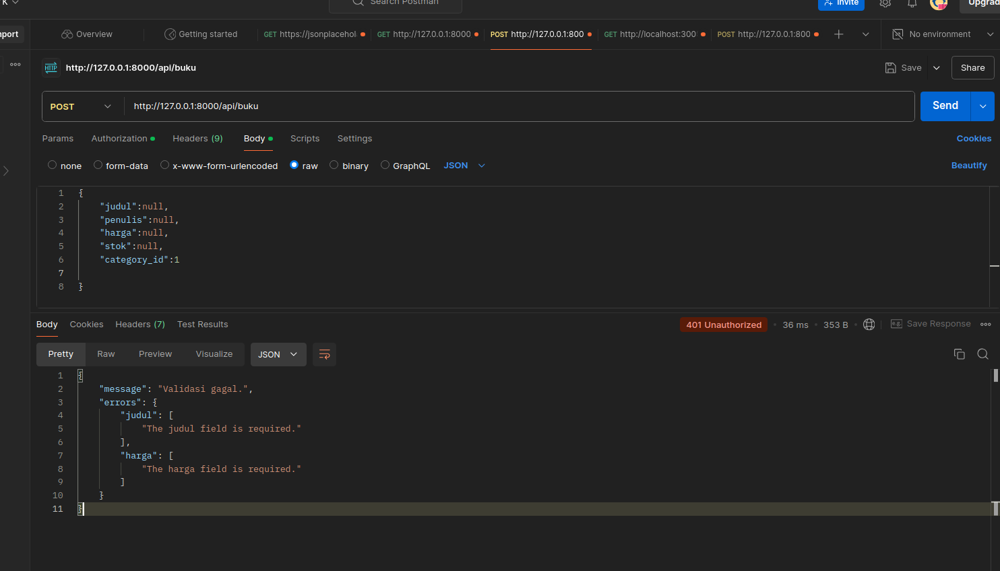
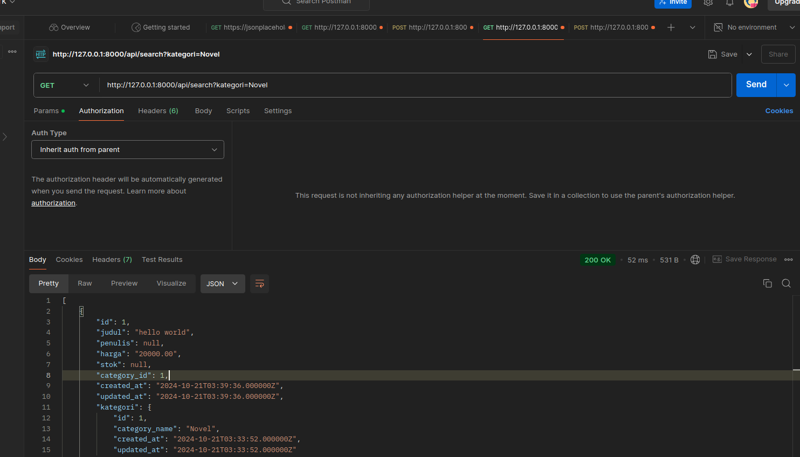
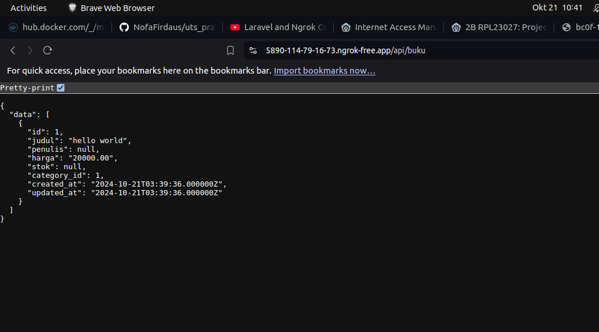

# Tambahkan Validasi:

# Rancang Endpoint Baru:

- **Tantangan:**
- **Skalabilitas :**
Query Optimization: Menggunakan eager loading untuk mengurangi jumlah query ke database ketika mengambil relasi seperti kategori. Akan mempercepat pemrosesan dan menghindari masalah N+1 query.

# Uji API Secara Publik:

